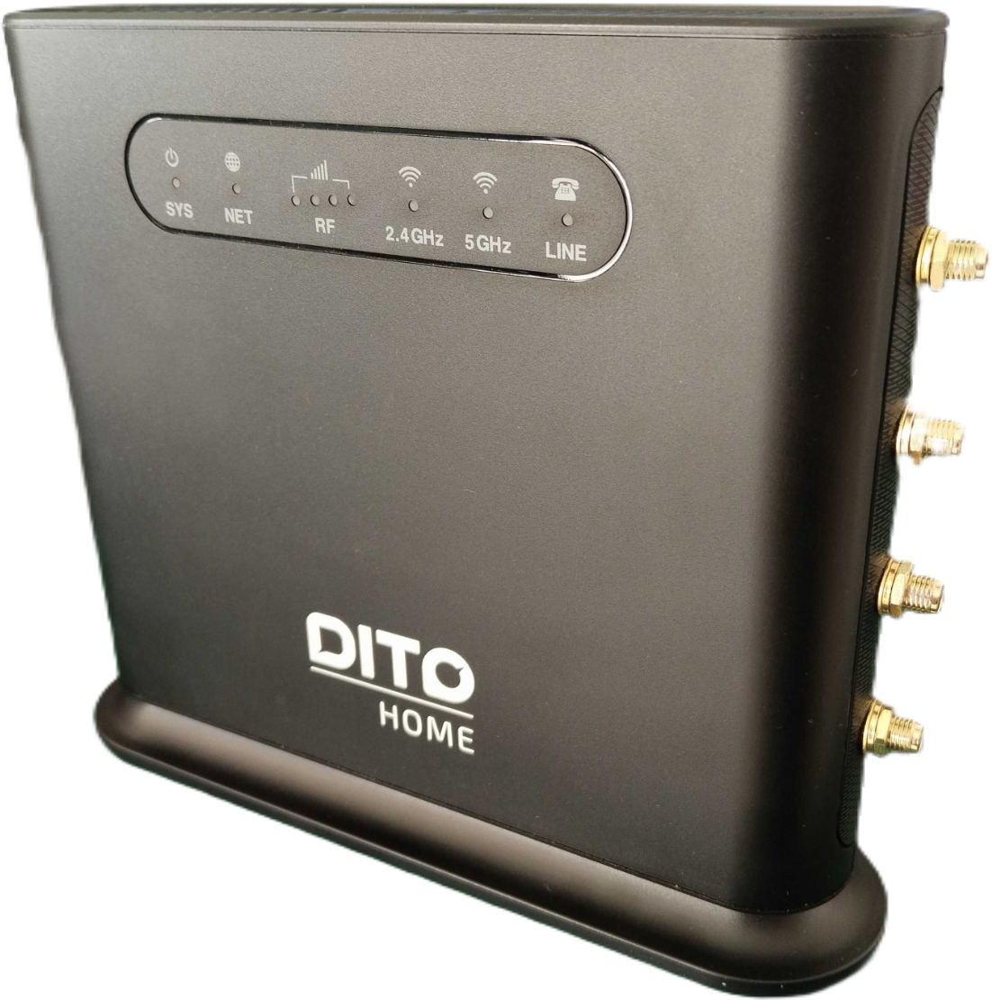

# OpenWrt for FiberHome UX2000

Custom OpenWrt build for the **FiberHome UX2000** — a MT7621A-based indoor
5G CPE. This repository holds the device-support overlay (DTS, image
definition, firmware meta-package, and first-boot uci-defaults) that turns a
stock OpenWrt 25.12 source tree into a flashable UX2000 image.

> ⚠️ **BACK UP YOUR FLASH FIRST — before you flash anything.**
> Dump the **entire** SPI-NOR (all MTD partitions) from the stock firmware
> *before* you touch it. Wiping a partition you can't recreate (especially
> `u-boot` or `factory`) can **permanently brick** the unit. This project
> learned that the hard way: the stock `u-boot` MTD was wiped during
> development, which is why this image requires the DragonBluep U-Boot
> (see [Flashing](#flashing) and [`bootloader/`](bootloader/README.md)).
> A full flash dump is your only recovery if something goes wrong.

> Status: builds and flashes. LAN + WiFi (MT7615 DBDC) + LuCI + multi-WAN
> (mwan3) are working. The cellular **data interface bring-up is not
> automated** in this image (module-agnostic by design) — see
> [Cellular](#cellular) below.

## Hardware


*Photo: retail unit, shown for hardware identification only. "DITO HOME" /
FiberHome / Quectel are trademarks of their respective owners; this project
is not affiliated with or endorsed by them.*

The unit ships as the **DITO HOME** CPE — a FiberHome UX2000 with an
internal **M.2 RM500U-CNV** 5G modem (the card discussed throughout this
repo). The front-panel indicator row labels map to the OpenWrt LED sysfs
names used by the device tree:

| Front label | Meaning | OpenWrt LED (`/sys/class/leds/`) |
|---|---|---|
| `SYS` | System / power | `orange:status` / `green:status` |
| `NET` | Internet / WAN up | `green:net` (green) + `blue:net` (blue) |
| `RF` | Cellular signal strength | `green:signal1`..`green:signal4` |
| `2.4GHz` / `5GHz` | WiFi radios | MT7615 DBDC phys (`phy0` 2.4G, `phy1` 5G) |
| `LINE` | RJ11 FXS / VoLTE | `green:volte` |

| | |
|---|---|
| SoC | MediaTek MT7621A (880 MHz, dual-core) |
| RAM | 256 MB DDR3 |
| Flash | 32 MB SPI-NOR |
| Switch | MT7530 (5× GE, DSA) |
| WiFi | MediaTek MT7615 DBDC (2.4 GHz + 5 GHz) |
| Modem | M.2 (NGFF) cellular slot — module-agnostic; ships support packages, builder supplies the card + interface |
| LEDs | status (orange/green), net (green/blue), signal bars (green 1–4), line/volte |
| UART | 115200 8N1 |
| Bootloader | DragonBluep U-Boot 2018.09 |

### Ethernet / switch layout (DSA)
- `lan1`..`lan4` — LAN switch ports
- `wan` — uplink (DHCP client by default)
- `wwan` — cellular interface (created manually / by your own init script)

### Partition map (DragonBluep U-Boot)
```
raspi:192k(u-boot),64k(u-boot-env),64k(factory),-(firmware)
```
DTS must use: u-boot `0x0/0x30000`, u-boot-env `0x30000/0x10000`,
factory `0x40000/0x10000` (**64k**, not the stock 128k), firmware
`0x50000/0x1FB0000` (32448k). `IMAGE_SIZE := 32448k`.

## Software / base version

- **OpenWrt v25.12.5** (git `6311c6495bcdde37aeaa68a41c04d97ee6499390`, 2026-08-07)
- Package manager: **apk** (not opkg)
- Feeds pinned (see `feeds.conf.default` in the OpenWrt tree)

## What this build includes

Meta-package `ux2000-support` pulls:

- **WiFi**: `kmod-mt7615e` + `kmod-mt7615-firmware`, `wpad-basic-mbedtls`
- **Web UI**: `luci-light` + `uhttpd` (+ `uhttpd-mod-ubus`) — baked in
- **Cellular (packages only)**: `libmbim`, `umbim`, `mbim-utils` (provides `mbimcli`),
  `kmod-usb-net-cdc-mbim`, `kmod-usb-serial-option`, `kmod-usb-serial-wwan`, `chat`
- **Multi-WAN / failover**: `mwan3` + `luci-app-mwan3`, `kmod-ipt-ipset`, `kmod-ip6tables`, `kmod-bonding`, `proto-bonding`
- **QoS**: SQM (`sqm-scripts` + `kmod-sched-cake` + `luci-app-sqm`) — legacy `luci-app-qos` intentionally **removed**
- **VPN**: `wireguard-tools` + `kmod-wireguard` + `luci-proto-wireguard`
- **Misc**: `ethtool`, `ip-full`, `uboot-envtools`

First-boot uci-defaults (run once, then self-delete):
- `99-ux2000-network` — LAN `192.168.8.1/24`, enables **both** WiFi radios *and*
  AP interfaces (OpenWrt leaves them disabled on a config reset), sets default APN
- `99-ux2000-mwan3` — `wan` = primary (metric 1), `wwan` = cellular backup (metric 2)
- `99-ux2000-voice` — SLIC/FXS enable for the RM500U-CNV (board is built for this card; it drives the RJ11 line). Harmless if no SIM/IMS.

## Cellular

The UX2000 has a USB cellular slot. This image is **modem-agnostic**: it
ships the kernel/modules and userspace tools to support a wide range of
USB cellular modems, but deliberately **does not pin a specific card or
ship a card-specific init script**. Drop in any compatible module
(MBIM/QMI/NCM/CDC-ECM/RNDIS), and the builder wires up the `wwan`
interface their own way.

> ⚠️ **WARNING — no turnkey cellular support.**
> This image ships the packages but **not** the interface logic for whatever
> modem you install. It does **not** auto-bring-up the cellular connection.
> Using the installed modem therefore requires you to **build your own
> `wwan` interface / bring-up** (define `network.wwan` with the right proto,
> APN, radio-on method, etc.). Only proceed if you know how to interface
> WWAN cards under OpenWrt — otherwise the modem slot will simply do nothing
> out of the box. The board's reference module is the RM500U-CNV, which this
> repo documents, but the bring-up is still left to you.

Packages included for cellular support:
- **MBIM**: `libmbim`, `umbim`, `mbim-utils` (provides `mbimcli`),
  `kmod-usb-net-cdc-mbim`, `kmod-usb-wdm`
- **QMI / option**: `kmod-usb-serial-option`, `kmod-usb-serial-wwan`,
  `kmod-usb-net`
- **NCM / ECM**: `kmod-usb-net-cdc-ncm`, `kmod-usb-net-cdc-ether`,
  `kmod-usb-net-huawei-cdc-ncm`
- **AT port**: `chat` (for manual AT use if needed)

> **This image does NOT ship an init script to auto-bring-up the modem.**
> The `network.wwan` interface and any boot-time bring-up logic are left to
> the builder — the exact sequence depends on the card fitted (radio-on
> method, APN, SA/NSA, etc.). The `mwan3` config already treats `wwan` as the
> cellular backup member, so once you define `network.wwan` with the right
> proto it slots into failover automatically.

Example bring-up for a **generic MBIM** module (adapt to your card):
```sh
uci set network.wwan=interface
uci set network.wwan.proto=mbim
uci set network.wwan.device=/dev/cdc-wdm0
uci set network.wwan.pdptype=ipv4v6
uci set network.wwan.apn=internet      # set your carrier APN
uci set network.wwan.metric=20
uci commit network
ifup wwan
```

AT commands (IMEI, band/tower lock, mode) are for **manual** tuning only
in picocom — keep them out of any automated path.

## Repository layout

```
openwrt-ux2000/
├── README.md
├── build.sh                      # helper: sync overlay into a OpenWrt tree + build
├── configs/
│   └── ux2000.config             # saved .config (reference)
├── package/firmware/ux2000-support/
│   ├── Makefile                  # meta-package + uci-defaults install
│   ├── 99-ux2000-network
│   ├── 99-ux2000-mwan3
│   └── 99-ux2000-voice
└── target/linux/ramips/
    ├── dts/mt7621_fiberhome_ux2000.dts
    └── image/device-fiberhome_ux2000.mk
```

## Building

### Prerequisites
- A Linux build host (this was built under **WSL2** on Windows)
- OpenWrt build deps installed (`setup.py` / `make prereq`)
- ~20 GB free, a few CPU cores

### Steps

```sh
# 1) Get OpenWrt 25.12 source + feeds (pins in feeds.conf.default)
git clone https://git.openwrt.org/openwrt/openwrt.git
cd openwrt
git checkout 6311c6495bcdde37aeaa68a41c04d97ee6499390   # v25.12.5
cp /path/to/feeds.conf.default .
./scripts/feeds update -a
./scripts/feeds install -a

# 2) Drop this overlay into the tree
#    (build.sh does this for you — see below)
cp -r openwrt-ux2000/package/firmware/ux2000-support  package/firmware/
cp    openwrt-ux2000/target/linux/ramips/dts/mt7621_fiberhome_ux2000.dts target/linux/ramips/dts/
#    append the device block to the ramips image makefile:
cat   openwrt-ux2000/target/linux/ramips/image/device-fiberhome_ux2000.mk \
      >> target/linux/ramips/image/mt7621.mk

# 3) Configure + build
cp openwrt-ux2000/configs/ux2000.config .config
make defconfig
# NOTE: on WSL the Windows PATH can leak a "Program Files/WireGuard" entry that
# breaks `find -execdir`. Always prefix the build with a clean PATH:
export PATH=/usr/local/sbin:/usr/local/bin:/usr/sbin:/usr/bin:/sbin:/bin
make -j$(nproc)
```

Artifacts land in `bin/targets/ramips/mt7621/`:
`openwrt-ramips-mt7621-fiberhome_ux2000-squashfs-sysupgrade.bin`,
`factory.bin`, `recovery.bin`, `initramfs-kernel.bin`.

### Using build.sh

`build.sh` assumes it is run from inside a checked-out OpenWrt tree and
copies the overlay in, then builds:

```sh
cd /path/to/openwrt
/path/to/openwrt-ux2000/build.sh
```

## Flashing

> ⚠️ **Bootloader requirement — read first.**
> This image targets the **DragonBluep U-Boot** MTD layout (single 32 MB
> `firmware` partition: `192k(u-boot),64k(u-boot-env),64k(factory),-(firmware)`).
> It will **only work on a unit already running that bootloader**. The stock
> FiberHome/DITO U-Boot uses a different (A/B) MTD map, and flashing this
> image onto it (or onto a unit whose bootloader was wiped) can **brick the
> device**. The `sysupgrade` image does **not** touch the bootloader
> partition — you must already be on DragonBluep U-Boot (see
> [`bootloader/`](bootloader/README.md) for the recovery/build artifacts).
> Only flash if you know your unit's bootloader state and have a UART/SPI
> recovery path.

### Step 0 — Back up the whole flash (do this first, once)

From a running OpenWrt on the unit (or via the bootloader's recovery shell),
dump every MTD partition to a safe place **before** flashing:

```sh
# on the router
mkdir -p /tmp/backup
for p in $(cat /proc/mtd | awk -F: 'NR>1{print $1}'); do
  mtddump /dev/$p /tmp/backup/$p.bin 2>/dev/null || \
  cat /dev/$p > /tmp/backup/$p.bin
done
# pull them off:
scp -r root@192.168.8.1:/tmp/backup ./ux2000-stock-backup-$(date +%Y%m%d)
```

At minimum, save **`u-boot`** (`/dev/mtd0`) and **`factory`** (`/dev/mtdX`,
holds MAC + WiFi calibration) — those cannot be regenerated and are what
make the device recoverable. Keep the backup off the device.

Via running OpenWrt (sysupgrade, **no settings kept** — the `-n` matters
because the WiFi/network uci-defaults only run on a clean flash):

```sh
scp openwrt-...-squashfs-sysupgrade.bin root@192.168.8.1:/tmp/
ssh root@192.168.8.1 "sysupgrade -n /tmp/openwrt-...-squashfs-sysupgrade.bin"
```

After flash: LAN `192.168.8.1`, WiFi SSID `OpenWrt` on both bands,
LuCI at http://192.168.8.1.

## Notes / gotchas

- **LuCI must be in the image** (`luci-light` + `uhttpd`). Earlier builds
  omitted `uhttpd` and LuCI was unreachable until installed via `apk add`.
- **MT7615 driver** must be selected (`kmod-mt7615e` + `kmod-mt7615-firmware`);
  the wrong `kmod-mt7915e` was selected once and produced no WiFi.
- **WSL PATH bug**: Windows `C:\Program Files\WireGuard` leaks into `$PATH`
  and breaks OpenWrt's `find -execdir`. Prefix every `make` with the clean
  `PATH` shown above.
- The `99-ux2000-voice` (SLIC/FXS) script enables the RJ11 line via the
  RM500U-CNV, which is the board's intended module and drives voice over
  VoLTE/IMS. It is harmless without a SIM/IMS-registered module.

## References

- **RM500U-CNV module wiki (Waveshare)** — M.2 B-KEY form factor, USB 3.1,
  MBIM/RNDIS/ECM modes, OpenWrt usage, common AT commands, dual-SIM:
  <https://www.waveshare.com/wiki/RM500U-CNV>
- **RM500U-CN / RG500U-CN AT command manual (PDF)** — authoritative AT
  reference (usbnet modes, `AT+CFUN`, `AT+QSLIC`, `AT+QCFG`, band/tower
  lock, IMEI, etc.):
  <https://files.waveshare.com/upload/c/cf/RG500U-CN_AT_command.pdf>
- **U-Boot source (DragonBluep)** — the replacement bootloader used on this
  device (single 32 MB firmware MTD layout):
  <https://github.com/DragonBluep/uboot-mt7621>

## License

OpenWrt and its packages are under their respective licenses (mostly GPL-2.0).
The device-support files in this repository are released under GPL-2.0.
See <https://www.gnu.org/licenses/old-licenses/gpl-2.0.html>.
